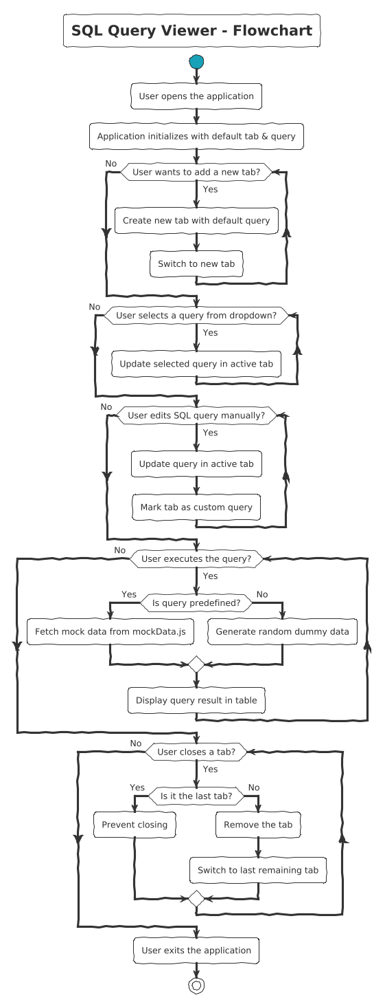

# SQL Query Viewer

## 🚀 Overview

SQL Query Viewer is a React-based web application that allows users to select, edit, and execute SQL queries in a multi-tab interface. The application simulates query execution by displaying mock data, supports tab management, and provides a clean UI using Material-UI.

## 🏗 Features

- Multi-tab interface for executing multiple queries.
- Predefined SQL query selection.
- Editable SQL query editor with real-time updates.
- Query result table with smooth scrolling and pagination.
- Mock data generation for custom queries.
- Dynamic tab creation and deletion.

## 🛠 Tech Stack

- **Framework:** React.Js
- **UI Library:** Material-UI (@mui/material)
- **State Management:** React Hooks (useState, useEffect, useRef)
- **Icons:** @mui/icons-material
- **CSS:** Custom styles with Material-UI's sx prop and CSS
- **Deployment:** Vercel

## 🚀 Installation & Setup

1. **Clone the repository**

   ```sh

    git clone https://github.com/R0hanNayan/sequel.git

    cd sequel

   ```
2. **Install dependencies**

```sh

    npm install

```

3. **Run the development server**

```sh

    npm start

```

## 🛜 Page Load Time Measurement

- Tool Used: Chrome DevTools (Lighthouse Performance Audit)
- Load Time Observed: ~0.6s (First Contentful Paint)
- Largest Contentful Paint: ~0.7s
- Performance Score: 98/100
- Accessibility: 87/100
- Best Practices: 93/100
- SEO: 91/100
- **Method**:

  - Open Chrome DevTools (Ctrl + Shift + I)
  - Navigate to the Performance tab
  - Run a Lighthouse audit under the Performance category
  - Observe the First Contentful Paint (FCP) and Largest Contentful Paint (LCP)

## 🎩 Optimizations for Performance

- **Efficient Re-Renders:** Avoided unnecessary state updates by ensuring only relevant components re-render.
- **Minimized DOM Operations:** Used Material-UI's optimized components instead of direct DOM manipulation.

## 📸 Component Diagram


## 📸 Flow Diagram


